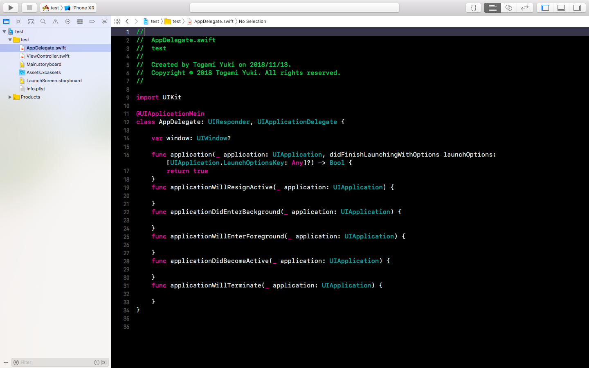

## 【Swift4】AppDelegete.swiftファイルについて


Xcodeを起動させた時、デフォルトで用意されている`AppDelegete.swift`というファイルが用意されています。

このファイルに記述されていることが何を意味するのかについて、この記事では説明してきます。

```swift
import UIKit

@UIApplicationMain
class AppDelegate: UIResponder, UIApplicationDelegate {

    var window: UIWindow?

    func application(_ application: UIApplication, didFinishLaunchingWithOptions launchOptions: [UIApplication.LaunchOptionsKey: Any]?) -> Bool {
        return true
    }
    func applicationWillResignActive(_ application: UIApplication) {
    }
    func applicationDidEnterBackground(_ application: UIApplication) {
    }
    func applicationWillEnterForeground(_ application: UIApplication) {
    }
    func applicationDidBecomeActive(_ application: UIApplication) {
    }
    func applicationWillTerminate(_ application: UIApplication) {
    }
}
```





**参考文献**

* <a href = "https://qiita.com/SoyaTakahashi/items/cc8f48af792c353cd9f3">【iOS】AppDelegate.swiftってなにしてんの？</a>
* 