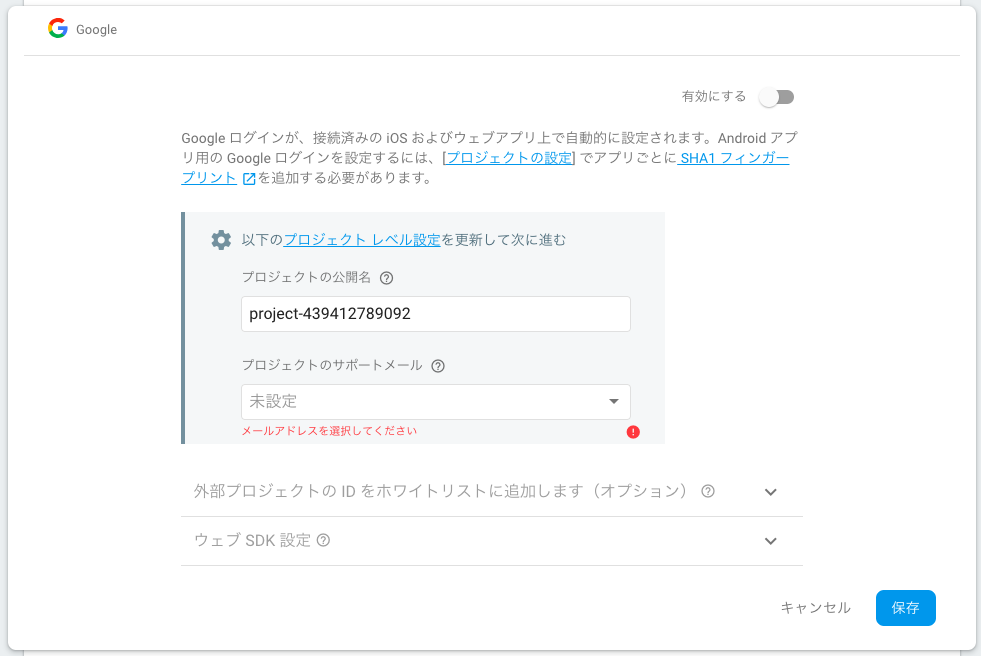

## 【Swift4】FirebaseAuthを用いたユーザーログイン機能の実装

### はじめに


<h2>Authとは</h2>

「Auth」とは日本語で「認証」という意味です。

TwitterやFacebook、Instagram等のSNSアプリを使用する際、誰が投稿したか誰がコメントしたかなど、ユーザーを特定する必要があります。

そのための機能がログイン機能であり、ユーザー本人かどうかを確認する必要があります。

その一連の流れを「Auth」と言います。

<画像：わかりやすい図をかけないか?>

<h2>Firebaseとアプリの連携</h2>

Firebaseとの連携方法は以下の記事に書いています。一箇所だけ違う点として、`Podfile`に以下のように記入します。

```swift
pod 'Firebase/Core'
pod 'Firebase/Auth'
```

<a href = "FireStore.md">＞【swift4】Firestoreを利用した簡易ToDoアプリの作成</a>

以上のフレームワークをインストールし、後は同じようにしてFirebaseとの連携は完了です。


<h2>EmailとPasswordによるログイン機能の実装</h2>

Firebaseのコンソールから、`Auth`>`ログイン方法`を選択し、`メール/パスワード`を有効にします。


<h3>新規登録の処理</h3>

新規登録ボタンを押した時に、実行される部分に、以下のコードを記述します。登録する際にエラーが出れば、それを表示し、成功すれば、登録したメールアドレスが表示されるようになっています。

```swift
Auth.auth().createUser(withEmail: emilTextField.text!, password: passTextField.text!) { (authResult, error) in
      if let error = error {
            print("memo:新規登録エラー\(error)")
            return
       }
       if let authResult = authResult{
            print("memo:新規登録成功",authResult.user.email!)
       }
}
```

<h3>ログインの処理</h3>

ログインボタンを押した時に、実行された部分に、以下のコードを記入します。ログイン時にエラーが出れば、それを表示し、成功すれば、登録したメールアドレスが表示されるようになっています。

```swift
Auth.auth().signIn(withEmail: emilTextField.text!, password: passTextField.text!) { (user, error) in
      if let error = error {
          print("memo:ログインエラー\(error)")
         return
       }
       if let user = user {
          print("memo:ログイン成功",user.user.email!)
       }
 }
```

<h2>Googleログイン機能の実装</h2>

<h3>Googleを有効へ</h3>

GoogleのGmailを利用したログイン機能の実装について説明します。

Firebaseのコンソールから、`Auth`>`ログイン方法`を選択し、Googleを有効にします。プロジェクトのサポートメールを入力し、保存します。



これでGoogleが有効になります。

そして、`Podfile`に以下のフレームワークを追加し、`pod install`インストールします。

```swift
pod 'GoogleSignIn'
```

<h3>URLスキームを設定する</h3>

URLスキームとは、ネットワーク上の位置(アドレス、ある情報がどこにあるのか)を示す手段であり、これを指定することでアプリ間の連携が可能になります。

以下の操作で、アプリとGoogleを紐付けます。

プロジェクトの`Info`＞`URLTypes`>`URL Schemes`に`GoogleService-Info.plist`の`REVERSED_CLIENT_ID`を追加します。


<h3>AppDelegateを修正</h3>

以下のコードで、先ほどURLスキームに登録したURLを開き、サインインに関するデータを受け取る。

```swift
func application(_ application: UIApplication, open url: URL, options: [UIApplicationOpenURLOptionsKey : Any])
        -> Bool {
return GIDSignIn.sharedInstance().handle(url,sourceApplication:options[UIApplicationOpenURLOptionsKey.sourceApplication] as? String,annotation: [:])
}
```

<h3>Googleサインインのボタン追加</h3>

`LoginViewController.swift`に以下を追加する。

```swift
//モジュール追加
import Firebase
import GoogleSignIn

//デリゲートを設定
GIDSignInUIDelegate
GIDSignInDelegate

//ViewDidLoad内に追加
GIDSignIn.sharedInstance().delegate = self
GIDSignIn.sharedInstance().uiDelegate = self
GIDSignIn.sharedInstance().clientID = FirebaseApp.app()?.options.clientID

//グーグルのボタンを追加
let googleBtn = GIDSignInButton()
googleBtn.frame = CGRect(x:20,y:280,width:self.view.frame.size.width - 40,height:60)
view.addSubview(googleBtn)
```

<h3>Googleログイン時の処理</h3>

```swift
func sign(_ signIn: GIDSignIn!, didSignInFor user: GIDGoogleUser!, withError error: Error?) {
     //Googleログイン時エラーが発生したら、エラーを返し、この関数から抜ける
     if let error = error {
            print("memo:Googleログイン後エラー",error)
            alert(memo:"memo:Googleログイン後エラー")
            return
     }
     //authenticationに情報が入っていなかったら、この関数から抜ける
     guard let authentication = user.authentication else { return }
        
     //ログインに成功したら、各種トークンを受け取る
     let credential = GoogleAuthProvider.credential(withIDToken: authentication.idToken,accessToken: authentication.accessToken)

     //トークンを受け取った後の処理を記述
     //・・・
}
```

Googleからトークンを受け取ったら、それらをFirebaseへ保存する処理をかく。

```swift
//トークンを受け取った後の処理を記述.Googleから得たトークンをFirebaseへ保存
Auth.auth().signInAndRetrieveData(with: credential) { (authResult, error) in
     if let error = error {
             print("memo:FirebaseへGoogleから得たトークン保存時にエラー",error)
     return
     }
       print("memo:Googleログイン成功",authResult?.additionalUserInfo)
}
```

ログイン失敗時の処理を記入。

```swift
func sign(_ signIn: GIDSignIn!, didDisconnectWith user: GIDGoogleUser!, withError error: Error!) {
    //Googleログイン時エラーが発生したら、エラーを返し、この関数から抜ける
    if let error = error {
          print("memo:Googleログイン失敗エラー",error)
    	return
    }
}
```


<h2>Twitterログイン機能の実装</h2>

Twitterログイン機能を実装するには、TwitterのAPIを取得する必要があります。API取得の方法については、以下の記事に詳しく書いてあるので、そちらを見て取得してください。

<a href = "http://www.sim-niigata.xyz/entry/twitter-api">＞【2018】Twitter・APIの取得審査が厳しい！取得方法を分かりやすく解説。</a>

<h3>Twitterログインの有効化</h3>

Firebaseのコンソールの、`Auth`>`ログイン方法`からTwitterログインを有効化し、TwitterのAPIキーと、APIシークレットキーを入力し、保存します。

<a href = "https://qiita.com/eKushida/items/f3ae462538e7c700fe91">＞[Swift版] 今さら聞けないFirebase③ Authentication (認証) Twitter 編</a>


これで、Twitterログインが有効になります。

<h2>Twitterログイン</h2>

`Podfile`に以下を追加し、`pod install`します。

```swift
pod 'TwitterKit'
```

Googleログインの時と同様にTwitterのURLスキームの設定を追加する。

```swift
twitterkit-{Consumer Key}
//例）twitterkit-togaminblog12341234
```

フレームワークの追加と、`AppDelegate.swift`の`didFinishLaunchingWithOptions`に以下を追加し、TwittterKitの初期設定をします。

ここでTwitterアプリの ConsumerKey、ConsumerKeySecret の情報を渡します。

```swift
//フレームワークの追加
import TwitterKit

//didFinishLaunchingWithOptionsの関数の中
TWTRTwitter.sharedInstance().start(withConsumerKey:"*****", consumerSecret:"********")
```

次に`LoginViewController.swift`に以下を追加。Twitterログインのボタンと、ボタンを押した時の処理を記述します。

Twitterからトークンを受け取り、Firebaseに登録します。

```swift
func TwitterLoginBtn(){
	let logInButton = TWTRLogInButton(logInCompletion: { session, error in
 		if (session != nil) {
          	let authToken = session?.authToken
          	let authTokenSecret = session?.authTokenSecret
         	print("memo:",authToken)
         	let credential = TwitterAuthProvider.credential(withToken: authToken!, secret: authTokenSecret!)
           	Auth.auth().signIn(with: credential) { (user, error) in
           	if let error = error {
            	print("memo:FirebaseへTwitterから得たトークン保存時にエラー",error)
               	return
           	}
              	print("memo:Twitterログイン成功")
           	}
     	} else {
          	print("memo:Twitterログインエラー")
      	}
   	})
    logInButton.frame = CGRect(x:screenWidth*0.11,y:screenHeight*2/3 + 60,width:screenWidth - screenWidth*0.22,height:45)
    view.addSubview(logInButton)
}
```


<h2>GitHub</h2>

Twitterログイン以外のソースコードを以下に載せてます。よければ参考にしてください。

<a href = "https://github.com/togamin/LoginSample.git">＞https://github.com/togamin/LoginSample.git</a>

<h2>まとめ</h2>

Emailとパスワードを用いたログイン方法に加え、Googleログイン、Twitterログインの方法について説明しました。


<a href = "https://dev.classmethod.jp/smartphone/ios11-feature-twitter-on-app/">＞[iOS 11] Social.framework廃止に伴い、アプリにTwitter機能を実装する方法</a>

<a href = "https://it1.jp/?p=992">＞SwiftでTwitterのOAuth認証を使ってログインする方法のまとめ</a>

<a href = "https://qiita.com/tfutada/items/1f2b0c5e5f7214bae61d">＞Firebase の Auth 機能を使ってみる。Swift版</a>

<a href = "https://firebase.google.com/docs/auth/ios/google-signin?hl=ja">＞iOS で Google ログインを使用して認証する</a>