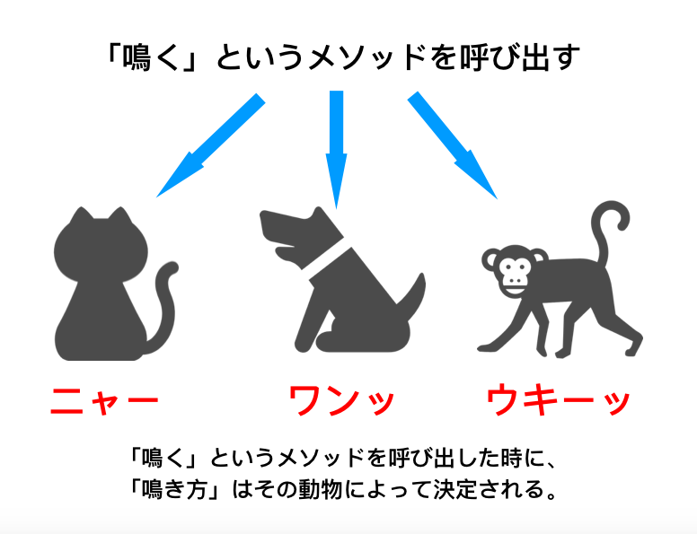
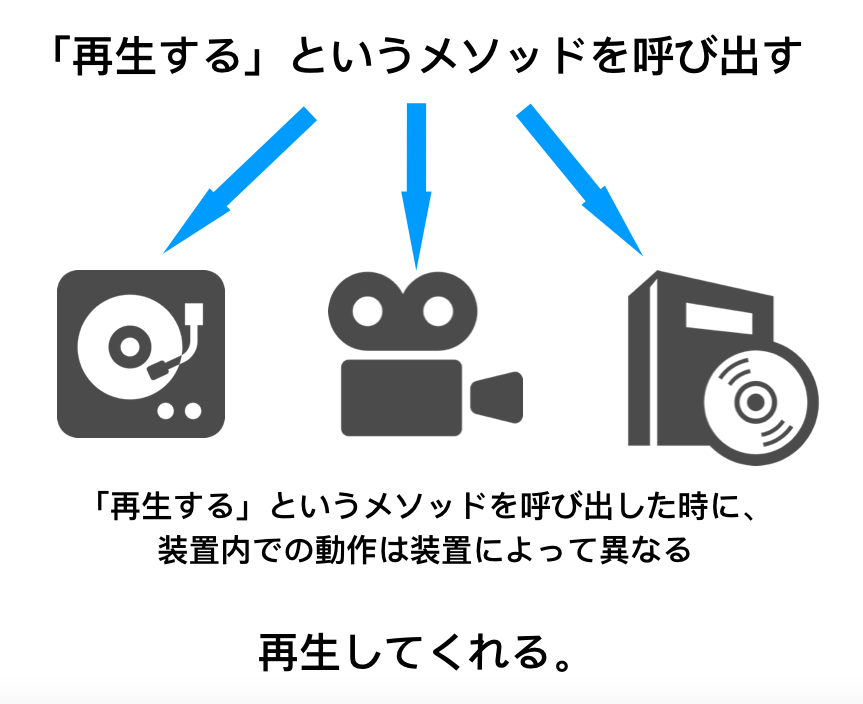

## 【Swift4】オブジェクト指向プログラミングの「ポリモーフィズム」について。


<h2>ポリモーフィズムとは?</h2>

ポリモーフィズムとは、オブジェクト指向プログラミングが持つ性質の一つで、

「同じメソッド呼び出しに対して、その動作が、オブジェクトによって決定される性質のこと」

です。

例えば、「ネコ」、「犬」、「猿」のオブジェクトがあり、それらは全て「鳴く」というメソッドを持っています。

それぞれに対して、同じ「鳴く」というメソッドを呼び出した場合、それぞれ違った鳴き方をします。

​


このように、同じメソッド呼び出しに対して、その動作がオブジェクトによって決定される性質のことを「ポリモーフィズム」と言います。

上記の例をコードで書くと以下のようになります。


```swift
//ネコのクラス
class Cat{
    func crow(){
        print("ニャー")
    }
}

//犬のクラス
class Dog{
    func crow(){
        print("ワンッ")
    }
}

//猿のクラス
class Monkey{
    func crow(){
        print("ウキーッ")
    }
}


//インスタンス化
var myCat = Cat()
var myDog = Dog()
var myMonkey = Monkey()


//「鳴く」というメソッドを呼び出す。
myCat.crow()
//出力 => ニャー
myDog.crow()
//出力 => ワンッ
myMonkey.crow()
//出力 => ウキーッ
```

このように同類のオブジェクトに対して、同じメソッドを呼び出した時に、オブジェクトによって違った動作をします。

次に、このポリモーフィズムのメリットについて説明していきます。


<h2>ポリモーフィズムメリット</h2>

<ol><li>異なるオブジェクトに対して、同一のメソッドを適用できる</li></ol>

<h3>異なるオブジェクトに対して、同一のメソッドを適用できる</h3>

例えば、この世の中には「再生ボタン」がついている装置がたくさんあります。

「カセットテープ」や、「射影機」、「DVDプレーヤ」等他にもたくさんあります。

「再生する」というメソッドを呼び出した時に、それぞれの内部では、異なる動作をしますが、最終的には再生されます。




似たような装置は全部使い方が同じだったら、使う側からしたら非常に便利です。共通の命令で動作をしてくれるので、もし、最新の音楽プレーヤが発明されたといても、「再生する」というメソッドを搭載していれば、そのメソッドを呼び出した時に大体何をしてくれるのかを予想することができます。

<h2>まとめ</h2>

ポリモーフィズムについて説明しました。


