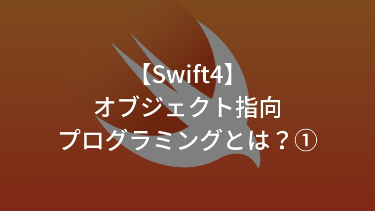
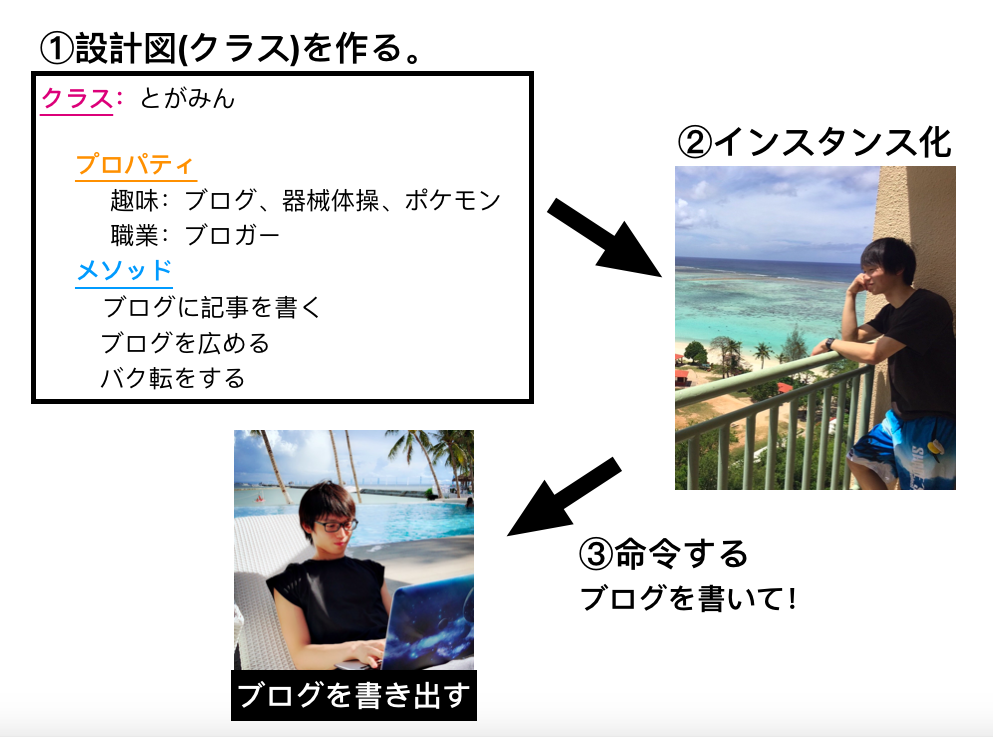

## 【Swift4】オブジェクト指向プログラミングとは①



<h2>オブジェクト指向プログラミング</h2>

オブジェクト指向とは、ある物の状態や機能をあらかじめまとめておき、使いたい時に、それをオブジェクト(物)として呼び出して、プログラムを書いていく考え方です。


もう少しわかりやすく言い換えると、

「設計図を元に、物(オブジェクト)を作り、その者に対して、やって欲しい動作を命令する」

といったプログラムの書き方をします。


このオブジェクト指向プログラミングを理解するにあたって、重要になってくる用語が以下の4つです。

* クラス・・・「オブジェクト(物)」の設計図
* プロパティ・・・「オブジェクト(物)」の性質、状態
* メソッド・・・「オブジェクト(物)」の動作
* インスタンス化・・・設計図をもとに、オブジェクト(物)を作る

そして、プログラムを書くにあたって、3ステップあります。

1. 設計図(クラス)を作成する。
2. 設計図を元にオブジェクトを作成する(インスタンス化)
3. 作成したオブジェクトに命令を出す。

次に、上記の流れに沿って、オブジェクト指向プログラミングの例を書きます。

<h2>オブジェクト指向プログラミングの例</h2>

<h3>例：とがみん</h3>

以下に「とがみん」というオブジェクトを作成し、動作させるコードを紹介します。

まず、イメージとしては以下のような感じです。



1. 「とがみん」の設計図を作ります。設計図はプロパティとメソッドを持ちます。すなわち、「とがみん」の性質や状態、できることが書かれています。
2. 次にインスタンス化します。設計図を元に、「とがみん」を作り出します。
3. 最後に作成した「とがみん」に命令を出します。「とがみん」はブログの記事を書いたり、広めたり、また、バク転をすることができます。なので、それらの命令を出すと実際にその行動をしてくれます。

これらをSwiftで書くと以下のようになります。

```swift
//①「とがみん」の設計図(クラス)を作成する。
class togamin{
	var hobby = ["ブログ","器械体操","ポケモン"]
    var occupation = "ブロガー"
    func wirteArticle(){
    	print("記事を書いてブログに投稿します。")
    }
    func advertise(){
        print("ブログを他人に広める。")
    }
    func backflip(){
        print("バク転をする")
    }
}

//②「とがみん」をインスタンス化する
var togamin = togamin()

//③「とがみん」に命令を出す。
togamin.wirteArticle()

// 出力　=>　記事を書いてブログに投稿します。
```


```swift
//①投稿の設計図例
class post {
    var userName = "tagaminnnn"
    var userImage = "togaminnnn.jpg"
    //・・・
    
    func tapDetail(){
    	print("タップすると詳細画面に遷移")
    }
    //・・・
    
    
}
```


<h3>クラスの書き方とメソッドの書き方について</h3>

クラスの書き方とメソッドの書き方について簡単に紹介します。

<h4>クラスの書き方</h4>

```swift
//クラスの書き方
class クラス名 {
    //プロパティ
    var 変数名 = 値
    //メソッド
    func 関数名(){
        //関数の処理
    }
}
```

<h4>メソッドの書き方</h4>

```swift
func 関数名(){
    //関数が実行された時の処理
}
```

クラスの書き方とメソッドの書き方について、初期化関数や引数、返り値等、まだまだあるのですが、後日の記事で紹介します。

<h2>オブジェクト指向のメリット</h2>

オブジェクト指向型プログラミングのメリットについて説明します。

メリットとしては主に2つ。

- 簡単にプログラムを書ける。
- 大人数で開発する際、プログラムを他者が壊す恐れが減る。
- コードを再利用できる。

<h3>簡単にプログラムを書ける。</h3>

設計図(クラス)さえ作っておけば簡単に様々な機能を持ったオブジェクト(物)を作ることができます。

Swiftではこの設計図に当たるものがデフォルトでたくさん用意されており、またインターネット上にもたくさん用意されているので、

それらを使えば簡単にいろんなオブジェクト(物)を作成することができます。

設計図を用いて作り出したオブジェクトに命令をすれば、それだけでプログラムが動作するので、

必ずしも設計図の中身を理解する必要がありません。

なので、簡単にプログラムを書くことができます。

<h3>大人数で開発する際、プログラムを他者が壊す恐れが減る。</h3>

設計図の中身を理解する必要がなく、変更する必要もないので、細かなコードのミスを減らすことができます。

<h2>まとめ</h2>


<h2>以下メモ</h2>


<h3>例２：計算機</h3>

* 計算機の設計図

```swift
//クラス
class Calculater{
    
    //プロパティ
	var numberA = 9
    var numberB = 3
    
    //メソッド
    func tasu(){
        print(numberA + numberB)
    }
    func hiku(){
        print(numberA - numberB)
    }
    func kakeru(){
        print(numberA * numberB)
    }
    func waru(){
        print(numberA / numberB)
    }
}

var calculater = Calculater()
calculater.tasu() //出力 => 12
calculater.hiku() //出力 => 6
```

これでは「9」と「3」の計算しかできないポンコツ計算機。

「足し算して」と命令すれば、「9＋3」の結果を表示してくれ、

「引き算して」と命令すれば、「9 − 3」の結果を表示してくれる。


「6」と「3」の足し算をして欲しくても、「6」と「3」のプロパティを持っていないので、計算してくれない。


クラスを以下のように書き換えると、インスタンス化するときに、プロパティを指定することができる。

```swift
class Calculater{
    var numberA:Int!
    var numberB:Int!
    init(numberA:Int,numberB:Int){
        self.numberA = numberA
        self.numberB = numberB
    }
    
    //以下足し算等のメソッド省略
    //・・・
}
```

このように書き換えることによって、インスタンス化する際にプロパティを指定することができるようになります。

```swift
//インスタンス化

//「9」と「3」の計算だけできるポンコツ計算機
var calculater93 = Calculater(numberA:9,numberB:3)
calculater93.tasu()// => 12
calculater93.hiku()// => 6
calculater93.kakeru()// => 27
calculater93.waru()// => 3


//「5」と「1」の計算だけできるポンコツ計算機
var calculater51 = Calculater(numberA:5,numberB:1)
calculater51.tasu()// => 6
calculater51.hiku()// => 4
calculater51.kakeru()// => 5
calculater51.waru()// => 5


//「4」と「2」の計算だけできるポンコツ計算機
var calculater42 = Calculater(numberA:4,numberB:2)
calculater42.tasu()// => 6
calculater42.hiku()// => 2
calculater42.kakeru()// => 8
calculater42.waru()// => 2
```


このコードのイメージはこんな感じ。


ただ、ポンコツ計算機をいくら作っても、非効率なので、一つの計算機で、どんな整数でも「たす」、「ひく」、「かける」、「わる」ができる計算機を作りたい。

どうすれば良いのか。

メソッドに値を渡せるようにすることで、一つの計算機で、あらゆる数の計算ができる計算機を作ることができる。


```swift
//まともな計算機の設計図
class Greatcalculater{
    func tasu(numberA:Int,numberB:Int){
        print(numberA + numberB)
    }
    func hiku(numberA:Int,numberB:Int){
        print(numberA - numberB)
    }
    func kakeru(numberA:Int,numberB:Int){
        print(numberA * numberB)
    }
    func waru(numberA:Int,numberB:Int){
        print(numberA / numberB)
    }
}

var greatcalculater = Greatcalculater()
greatcalculater.kakeru(numberA:6,numberB:3)// => 出力　18
greatcalculater.hiku(numberA:8,numberB:5)// => 出力　3
```

では、次に、計算機で計算した値同士の計算をさせたい場合はどうしたら良いか。

例えば、「1 + 2」と「3 + 4」の結果を掛け算したい場合、

```swift
greatcalculater.tasu(numberA:1,numberB:2)
```


<h2>クラスの書き方</h2>

上記のコックの例でも書きましたが、クラスは以下のように書きます。

```swift
class クラス名 {
    //プロパティ
    var 変数名 = 値
    //メソッド
    func 関数名(){
        //関数の処理
    }
}
```

また、下記のように書くことによって、インスタンス化する時に、プロパティの値を指定することができるようになります。「init」はイニシャライザ、初期化関数と言って、インスタンス化する際に、最初に呼ばれる関数です。

```swift
class クラス名 {
    //プロパティ
    var 変数名：型
    init(変数名：型){
        self.変数名 = 変数名
    }
}
```

この書き方で、ラーメンの設計図を作ります。

```swift
class ramen{
    
    var yakumi = "ネギ"
    var tyomiryo:String
    var utuwa = "器B"
    
    init(tyomiryo:String){
        self.tyomiryo = tyomiryo
    }
    func whatAzi(){
        print(self.tyomiryo)
    }
}
```

インスタンス化する際に、クラス内のプロパティを指定することができるので、一つの設計図(クラス)で、醤油ラーメンも、味噌ラーメンも作ることができます。

```swift
var syoyuRamen = ramen(tyomiryo: "醤油")
syoyuRamen.whatAzi() //出力　=> 醤油

var misoRamen = ramen(tyomiryo: "味噌")
misoRamen.whatAzi() //出力　=> 醤油
```

<h2>メソッドの書き方</h2>

メソッドの書方は以下の3つがあります。

1)引数、戻り値がない場合。

```swift
func 関数名(){
    //関数が実行された時の処理
}
```

2)引数があって、戻り値がない場合。

 ```swift
func 関数名(引数:型){
    //関数が実行された時の処理
}
 ```

3)引数と戻り値がある場合。

```swift
func 関数名(引数:型)->返り値の型{
    //関数が実行された時の処理
    return 戻り値
}
```

それぞれの具体的な使い方を説明していきます。

以下は自分の年齢をただ言うだけの関数です。以下の関数だと、20歳の人しか使うことができません。

```swift
func sayAge(){
    //関数が実行された時の処理
    print("私は20歳です。")
}

sayAge()　// 出力　=> 私は20歳です。
```

しかし以下のように引数を使えるようにすることで、何歳の人でも使うことができるようになります。

```swift
func sayAge(age:Int){
    //関数が実行された時の処理
    print("私は" + age + "歳です。")
}

sayAge(age:20) // 出力　=> 私は20歳です。
sayAge(age:23) // 出力　=> 私は23歳です。
```

上記2つの書き方だと、関数の中で完結しており、その関数の外で値を扱うことができません。なので、以下のように書くことのよって、関数の外で値を使うことができるようになります。

```swift
func sayAge(age:Int)->Int{
    //関数が実行された時の処理
    print("私は" + age + "歳です。")
    return age
}

var yukiAge = sayAge(age:20) // 出力　=> 私は20歳です。
var togaminAge = sayAge(age:23) // 出力　=> 私は23歳です。

print(yukiAge) // 出力　=> 私は20歳です。
print(togaminAge) // 出力　=> 私は23歳です。

var sumAge = yukiAge + togaminAge

print("私たちの年齢の合計は" + sumAge + "です。")
```

戻り値がない場合は関数の外側で値が使えません。

```swift
func sayAge(age:Int){
    //関数が実行された時の処理
    print("私は",age,"歳です。")
}

var myAge = sayAge(age:23)
print(myAge) // 出力 => ()
//値は何も入っていない
```


<h2>まとめ</h2>

今回はオブジェクト指向について説明しました。


