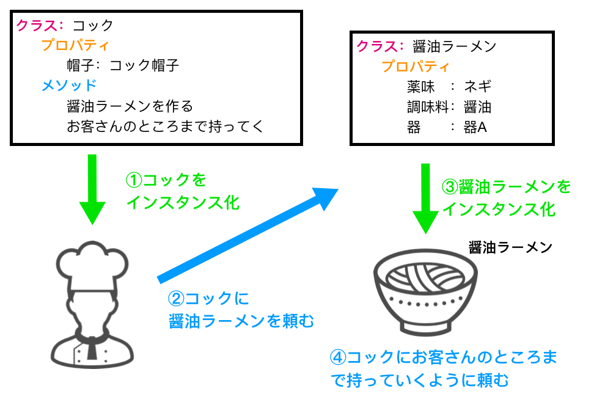

## 【Swift4】オブジェクト指向プログラミングについて

<h2>はじめに</h2>


<h2>オブジェクト指向プログラミング</h2>

オブジェクト指向とは、ある物の状態や機能をあらかじめまとめておき、使いたい時に、それをオブジェクト(物)として呼び出して、プログラムを書いていく考え方です。

このオブジェクト指向プログラミングをするにあたって、重要になってくる用語が以下の4つです。

* クラス・・・「オブジェクト(物)」の設計図
* プロパティ・・・「オブジェクト(物)」の性質、状態
* メソッド・・・「オブジェクト(物)」の動作
* インスタンス化・・・設計図をもとに、オブジェクト(物)を作る

<h2>オブジェクト指向プログラミングの例</h2>

例えば、ラーメン屋をイメージしてみてください。醤油ラーメンをコックに頼むと、コックはラーメンを作って持ってきてくれます。

この状況をプログラムで書く場合、下記のような手順で書いていきます。

* それぞれのオブジェクト(物)の設計図を用意する。
* その設計図を元に、オブジェクト(物)を作成する。
* 作成したオブジェクトを動作させる。



上の図の例では、まずコック、味噌ラーメンの設計図(クラス)を用意します。設計図を用意したら、その設計図をもとに、コックを作成します(インスタンス化)。

コックを作成したら、コックに命令を出します。コックは醤油ラーメンを作れるので、醤油ラーメンを頼むと作ってくれます。

その後、お客さんのところまで持って行くように頼むと持って行ってくれます。

これをSwiftで書くと以下のようになります。

コックの設計図

```swift
//コックの設計図(クラス)
class cock {
    //コックの状態(プロパティ)
    var hat = "コック帽"
    
    //コックができること。動作(メソッド)
    func makeSyoyu(){
        //醤油ラーメンの設計図をもとに醤油ラーメンを作る処理。
        var ramen = syouiRamen　//醤油ラーメンインスタンス化
        print("醤油ラーメン完成")
        return ramen
    }
    func goCustomer(){
        //客のところまで行く処理。
        print("どうぞ召し上がれ")
    }
}
```

醤油ラーメンの設計図

```swift
//醤油ラーメンの設計図(クラス)
class syouiRamen {
    //醤油ラーメンの状態(プロパティ)
    var yakumi = "ネギ"
    var tyomiryo = "醤油"
    var utuwa = "器B"
}
```

処理の内容

```swift
//コックのインスタンス化
var person = cock()
//コックに醤油ラーメンを作るように頼む。
person.makeSyoyu()
//お客さんのところまで持って行くよう頼む。
person.goCustomer() // 出力　=> どうぞ召し上がれ
```

このようにして、ある物の状態や機能をあらかじめ設計図(クラス)としてまとめておき、使いたい時に、それをオブジェクト(物)として呼び出して書いていくプログラミングのことをオブジェクト指向プログラミングと言います。


<h2>オブジェクト指向のメリット</h2>

オブジェクト指向型プログラミングのメリットについて説明します。

メリットとしては主に2つ。

* 簡単にプログラムを書ける。
* 大人数で開発する際、プログラムを他者が壊す恐れが減る。

<font color = "red">簡単にプログラムを書ける。</font>

設計図(クラス)さえ作っておけば簡単にオブジェクト(物)を作ることができます。Swiftではこの設計図に当たるものがデフォルトでたくさん用意されており、またインターネット上にもたくさん用意されているので、それらを使えば簡単に様々な機能を持ったオブジェクト(物)を作成することができます。

<font color = "red">大人数で開発する際、プログラムを他者が壊す恐れが減る。</font>

設計図(クラス)の中身を必ずしも理解する必要はなく、その設計図を用いて作り出したオブジェクトに命令をすれば良いだけなので、細かなコードのミスが減らせる。

他にもメリットはあるかもしれませんが、主なメリットはこの2つです。

<h2>クラスの書き方</h2>

上記のコックの例でも書きましたが、クラスは以下のように書きます。

```swift
class クラス名 {
    //プロパティ
    var 変数名 = 値
    //メソッド
    func 関数名(){
        //関数の処理
    }
}
```

また、下記のように書くことによって、インスタンス化する時に、プロパティの値を指定することができるようになります。「init」はイニシャライザ、初期化関数と言って、インスタンス化する際に、最初に呼ばれる関数です。

```swift
class クラス名 {
    //プロパティ
    var 変数名：型
    init(変数名：型){
        self.変数名 = 変数名
    }
}
```

この書き方で、ラーメンの設計図を作ります。

```swift
class ramen{
    
    var yakumi = "ネギ"
    var tyomiryo:String
    var utuwa = "器B"
    
    init(tyomiryo:String){
        self.tyomiryo = tyomiryo
    }
    func whatAzi(){
        print(self.tyomiryo)
    }
}
```

インスタンス化する際に、クラス内のプロパティを指定することができるので、一つの設計図(クラス)で、醤油ラーメンも、味噌ラーメンも作ることができます。

```swift
var syoyuRamen = ramen(tyomiryo: "醤油")
syoyuRamen.whatAzi() //出力　=> 醤油

var misoRamen = ramen(tyomiryo: "味噌")
misoRamen.whatAzi() //出力　=> 醤油
```

<h2>メソッドの書き方</h2>

メソッドの書方は以下の3つがあります。

1)引数、戻り値がない場合。

```swift
func 関数名(){
    //関数が実行された時の処理
}
```

2)引数があって、戻り値がない場合。

 ```swift
func 関数名(引数:型){
    //関数が実行された時の処理
}
 ```

3)引数と戻り値がある場合。

```swift
func 関数名(引数:型)->返り値の型{
    //関数が実行された時の処理
    return 戻り値
}
```

それぞれの具体的な使い方を説明していきます。

以下は自分の年齢をただ言うだけの関数です。以下の関数だと、20歳の人しか使うことができません。

```swift
func sayAge(){
    //関数が実行された時の処理
    print("私は20歳です。")
}

sayAge()　// 出力　=> 私は20歳です。
```

しかし以下のように引数を使えるようにすることで、何歳の人でも使うことができるようになります。

```swift
func sayAge(age:Int){
    //関数が実行された時の処理
    print("私は" + age + "歳です。")
}

sayAge(age:20) // 出力　=> 私は20歳です。
sayAge(age:23) // 出力　=> 私は23歳です。
```

上記2つの書き方だと、関数の中で完結しており、その関数の外で値を扱うことができません。なので、以下のように書くことのよって、関数の外で値を使うことができるようになります。

```swift
func sayAge(age:Int)->Int{
    //関数が実行された時の処理
    print("私は" + age + "歳です。")
    return age
}

var yukiAge = sayAge(age:20) // 出力　=> 私は20歳です。
var togaminAge = sayAge(age:23) // 出力　=> 私は23歳です。

print(yukiAge) // 出力　=> 私は20歳です。
print(togaminAge) // 出力　=> 私は23歳です。

var sumAge = yukiAge + togaminAge

print("私たちの年齢の合計は" + sumAge + "です。")
```

戻り値がない場合は関数の外側で値が使えません。

```swift
func sayAge(age:Int){
    //関数が実行された時の処理
    print("私は",age,"歳です。")
}

var myAge = sayAge(age:23)
print(myAge) // 出力 => ()
//値は何も入っていない
```


<h2>まとめ</h2>

今回はオブジェクト指向について説明しました。プログラミングをする上で、理解必須の概念なので、しっかり頭に入れておきたいところです。


