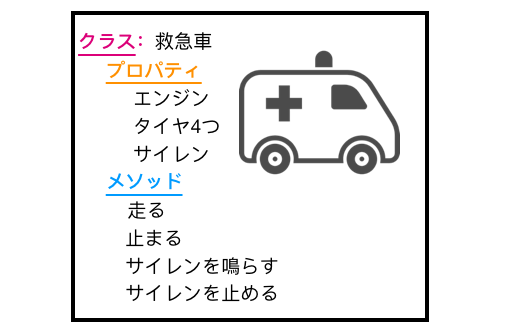
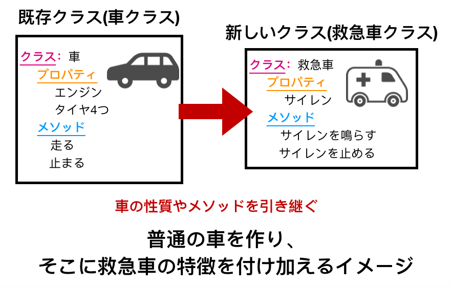
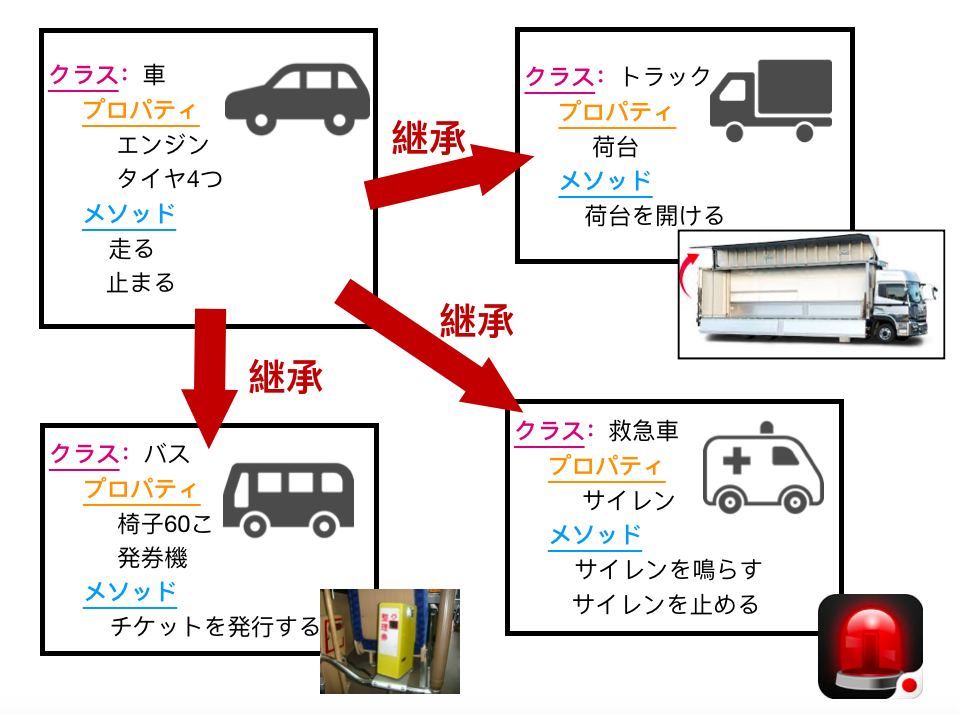
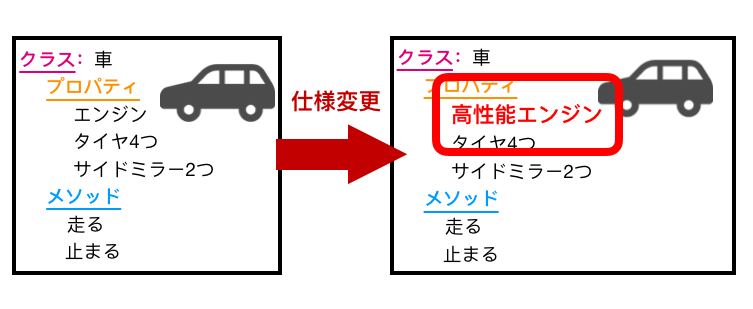

## 【Swift4】オブジェクト指向プログラミング「継承」について

(未修正)

以前の記事で、オブジェクト指向プログラミングについて説明したのですが、

<a href = "https://togamin.com/2018/11/16/object/">＞【Swift4】オブジェクト指向プログラミングとは</a>

今回の記事では、オブジェクト指向プログラミングの要素の一つである「継承」とは何か、そのメリットは何かといった事を説明していこうかと思います。

<h2>継承とは</h2>

継承とは、既存の設計図(クラス)の属性(プロパティ)、動作(メソッド)を新しく作成するクラスに引き継ぐ事です。

例えば、「救急車の設計図(クラス)」を書きたいとします。



以前のオブジェクト指向プログラミングの記事で説明したように、設計図を書くと以下のようになります。

<a href = "https://togamin.com/2018/11/16/object/">＞【Swift4】オブジェクト指向プログラミングとは</a>

 ```swift
//救急車クラス
class Ambulance{
	var engin = "エンジン"
    var tireNum = 4//タイヤの数
    var siren = "サイレン"
    func run(){
    	print("走る")
    }
    func stop(){
        print("止まる")
    }
    func sirenOn(){
        print("サイレンを鳴らす")
    }
    func sirenOff(){
        print("サイレンを止める")
    }
}

//バスクラス
class Bus{
	var engin = "エンジン"
    var tireNum = 4//タイヤの数
    var hakkenki = "発券機"
    func run(){
    	print("走る")
    }
    func stop(){
        print("止まる")
    }
    func makeTicket(){
    	print("チケットを発行")
    }
}

//トラッククラス
class Truck{
    var engin = "エンジン"
    var tireNum = 4//タイヤの数
    var nidai = "荷台"
    func run(){
    	print("走る")
    }
    func stop(){
        print("止まる")
    }
    func openNidai(){
    	print("荷台を開ける")
    }
}
 ```

共通部分

```swift
//共通部分
var engin = "エンジン"
    var tireNum = 4//タイヤの数
func run(){
  	print("走る")
}
func stop(){
   	print("止まる")
}
```


ただ、既存クラスとして、以下のような「車クラス」がある場合、




「救急車クラス」は、「車クラス」のプロパティや、メソッドを引き継いで、プログラムを書く事ができます。

実際に書いたコードが以下です。

```swift
//②車クラス
class car{
    var engin = "エンジン"
    var tireNum = 4//タイヤの数
    func run(){
    	print("走る")
    }
    func stop(){
        print("止まる")
    }
}

//③「車クラス」を引き継いで書いた、「救急車クラス」
class ambulance:car{
    var siren = "サイレン"
    func run(){
    	print("走る")
    }
    func stop(){
        print("止まる")
    }
}
```

イメージとしては、最初から救急車を作るのではなく、まず初めに車を作ってから、救急車と車の違いの部分を作り上げるといったイメージになります。

このように、既存クラスのプロパティや、メソッドを新たに作成するクラスに引き継ぐ事を「継承」と言います。

<h2>「継承」のメリット</h2>

継承のメリットについて、主に2つあります。

<ol><li>プログラムを書く量を減らせる</li><li>仕様変更の際、変更箇所を減らせる</li></ol>

それぞれについて説明していきます。

<h3>プログラムを書く量を減らす事ができる</h3>

クラスを継承する事によって、プログラムを書く量を減らす事ができます。

例えば、車100台のオブジェクトを作らないといけない。しかも、バスや救急車、その他いろんな種類の車があるといった状況を思い浮かべてください。


それぞれの車一台一台の設計図を書く事は非常に手間がかかります。

なので、それら全てに共通する部分だけを、あらかじめクラスとして作っておき、

それを「継承」する事によって、同じ内容を何度も書く必要がなくなります。



トラックや救急車やバスは全て、エンジンやタイヤが4つあり、走ったり、止まることができます。

それらの共通部分を「車クラス」としてまとめ、再利用する事によって、コードを書く量を減らす事ができます。

以下は「車クラス」を継承して書いた、「バスクラス」と「トラッククラス」と「救急車クラス」です。


```swift
//②の「車クラス」を継承して書いた「バスクラス」
class bus:car{
    var chair = 60
    var hakkennki = "発券機"
    func makeTicket(){
    	print("チケットを発行")
    }
}
//②の「車クラス」を継承して書いた「トラッククラス」
class truck:car{
    var nidai = "荷台"
    func openNidai(){
    	print("荷台を開ける")
    }
}
//②の「車クラス」を継承して書いた「救急車クラス」
class ambulance{
    var siren =  "サイレン"
    func sirenOn(){
        print("サイレンを鳴らす")
    }
    func sirenOff(){
        print("サイレンを止める")
    }
}
```


<h3>仕様変更の際、変更箇所を減らすことができる</h3>

2つ目のメリットについて、上記100台の車のオブジェクトを作った後、

仕様変更があって、すべての車に、より性能の良いエンジンを使う事になったとします。

もし、車一台一台に対して、設計図を作成していた場合、車の台数分書き換えないといけません。

しかし、共通部分を抜き出したクラスを継承してクラスを書いていた場合、

その共通部分が書かれたクラスの中身を一箇所変更するだけで、全てに適応させる事ができます。



上記の例では、車クラスの中の「エンジン」を「高性能エンジン」に変更するだけで、その設計図を継承したクラスに適用させることができます。

このように、共通部分を抜き出したクラスをあらかじめ作り、それを継承する事で、仕様変更があった場合に、

変更箇所を減らす事ができます。

<h2>まとめ</h2>

オブジェクト指向における「継承」について説明しました。

「継承」とは、既存のクラスの属性を新しく作成するクラスに引き継ぐ事。

そしてそのメリットは、

<ol><li>プログラムを書く量を減らせる</li><li>仕様変更の際、変更箇所を減らせる</li></ol>

の2つあります。


<h2>メモ</h2>

以下の3人の大学生がいて、それぞれの設計図を書くとします。


プログラムで記述すると以下のようになります。

```swift
//Aさんの設計図
class Asan {
    //プロパティ
    var occupation = "大学生"
    var major = "心理学"
    //メソッド
    func goSchool(){
        print("大学に行く")
    }
    func goBackHome(){
        print("大学から家に帰る")
    }
    func humanObservation(){
    	print("人間観察をする")
    }
}

//Bくんの設計図
class Bkun {
    //プロパティ
    var occupation = "大学生"
    var major = "体育学"
    //メソッド
    func goSchool(){
        print("大学に行く")
    }
    func goBackHome(){
        print("大学から家に帰る")
    }
    func run(){
    	print("校庭を走る")
    }
}

//Cくんの設計図
class Ckun {
    //プロパティ
    var occupation = "大学生"
    var major = "電子工学"
    //メソッド
    func goSchool(){
        print("大学に行く")
    }
    func goBackHome(){
        print("大学から家に帰る")
    }
    func makeRadio(){
    	print("ラジオを作る")
}
```


上記の設計図をよく見てみると、以下の点が全てに共通して書かれています。

```swift
//プロパティ
var occupation = "大学生"

//メソッド
func goSchool(){
    print("大学に行く")
}
func goBackHome(){
    print("大学から家に帰る")
}
```


例えば100人の大学生がいて、それぞれの設計図を書くのに、同じことを100回書くのは手間がかかるので、

大学生に共通するプロパティや、メソッドをまとめた、大学生用の設計図、大学生クラスを作ります。

```swift
class UniversityStudent{
    //プロパティ
	var occupation = "大学生"
	//メソッド
	func goSchool(){
    	print("大学に行く")
	}
	func goBackHome(){
    	print("大学から家に帰る")
	}
}
```

これを作成し、「継承」することによって、Aさんや、Bくん、Cくんの設計図は以下のように書くことができます。

```swift
//Aさんの設計図
class Asan:UniversityStudent{
    var major = "心理学"
    func humanObservation(){
    	print("人間観察をする")
    }
}
//Bさんの設計図
class Bkun:UniversityStudent{
    var major = "体育学"
    func humanObservation(){
    	print("校庭を走る")
    }
}
//Cさんの設計図
class Ckun:UniversityStudent{
    var major = "電子工学"
    func humanObservation(){
    	print("ラジオを作る")
    }
}
```


<h2>「継承」することによるメリット</h2>

<h3>コードを書く量を抑えられる</h3>

上記の例で説明したように、共通部分を一つの設計図にまとめることによって、何度も同じことを書く手間を省くことができます。

<h3>コードを修正する際変更箇所を減らすことができる</h3>

共通部分を抜きだし、一つにまとめることによって、もし変更したい箇所が出てきた場合に、共通部分の設計図だけ書き換えれば、全ての大学生に変更を適用させることができます。

上記の例で、間違えて3人が大学生ではなく、高校生だったことに、書いた後気付いた場合、もし、共通部分をまとめていなかったら、人数分以下のように書き換えないといけません

```swift
//変更前
var occupation = "大学生"
//変更後
var occupation = "高校生"
```

もし、共通部分をまとめ、「継承」していたなら、一箇所書き換えることによって、そのクラスを継承しているクラス全てに適用させることができます。


<h2>その他例</h2>

<h3>RPG</h3>

一言次行く前に。


余裕を持つ。


